# Auto-Git 🚀

Auto-Git is a set of command-line utilities for managing GitHub repositories and their contents directly from the terminal. It simplifies common GitHub tasks such as creating, deleting, and listing repositories, as well as listing the contents of those repositories.

--

  
  
  
  
   
  
  
  

## Table of Contents 📚

1. [Installation](#installation-%EF%B8%8F)
2. [Install Dependencies](#step-2-install-dependencies)
3. [Setup](#step-3-run-to-install)
4. [Examples](#examples)
5. [Requirements](#requirements-)
6. [Exit Status Codes](#exit-status-codes-)
7. [Authors](#authors-)
8. [Bugs and Feedback](#bugs-and-feedback-)
9. [Generate Personal Access Token](#guide-)

---

## Installation 🛠

Follow these steps to install Auto-Git:

### Step 1: Clone the Repository

Clone this repository to your local machine by running:

git clone https://github.com/Acrsahil/Auto-Git.git
cd Auto-Git

## Step 2: Install Dependencies

Make sure you have python3 and pip installed

## Setup Instructions ⚙️

Before using Git-Auto, ensure that you have configured your GitHub access token for authentication.

 [Generate GitHub Personal Access Token](#guide-)

    Visit your GitHub Personal Access Tokens page.
    Click Generate new token.
    Select the necessary permissions (e.g., repo for full repository access).
    Save the token securely.

## Step 3: Run to install

    ./install.py

It will ask you to input your GitHub username and access token.

## Guide 📚

Below is a step-by-step guide to help you get Personal Access Tokens:

### Step 1: Terminal
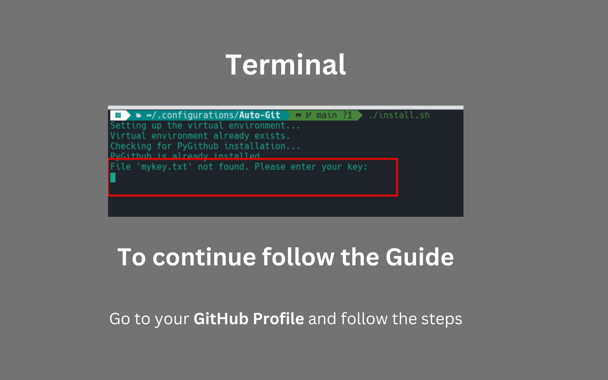

### Step 2: Settings
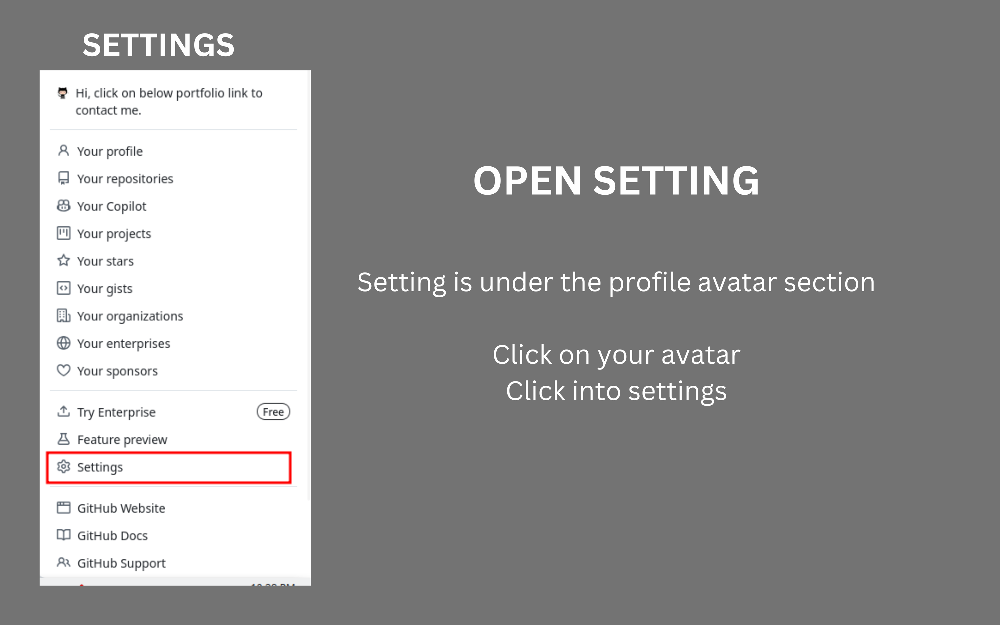

### Step 3: Developer Settings
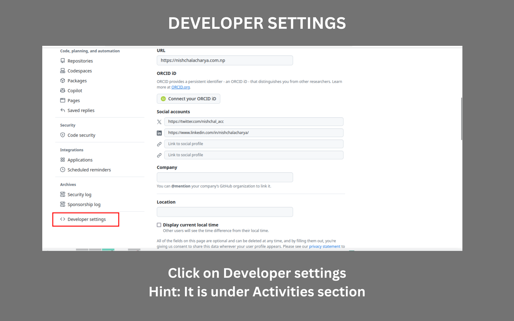

### Step 4: Personal Access Token
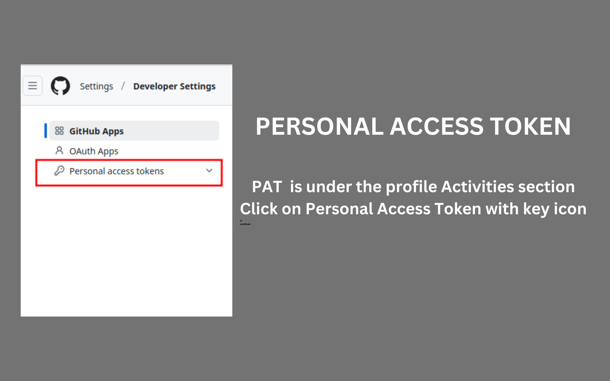

### Step 5: Tokens (Classic)
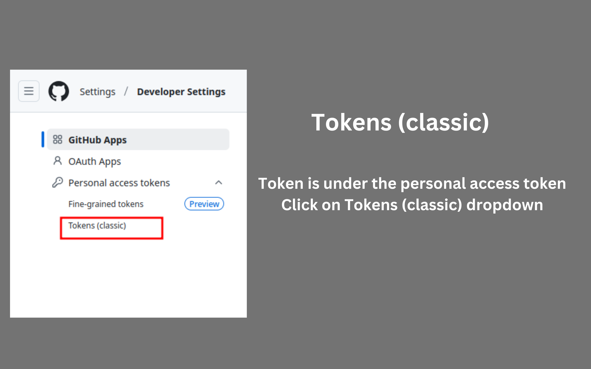

### Step 6: Generate new Token
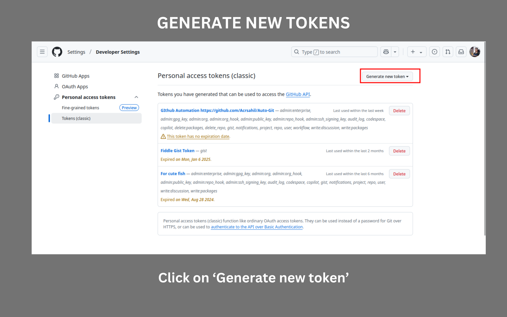

### Step 7: Generate new Token (Dropdown)
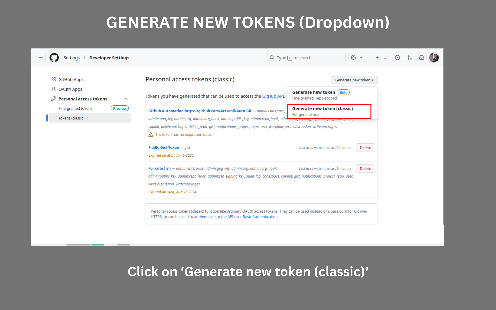

### Step 8: New Personal Access Token (Classic)
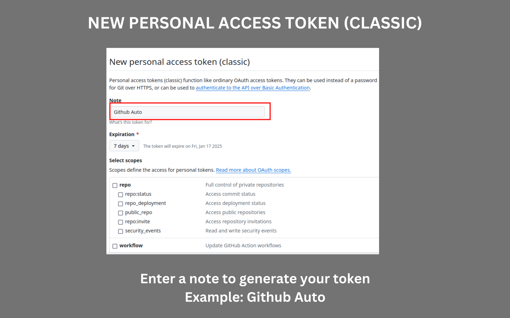

### Step 9: Token Expiraion
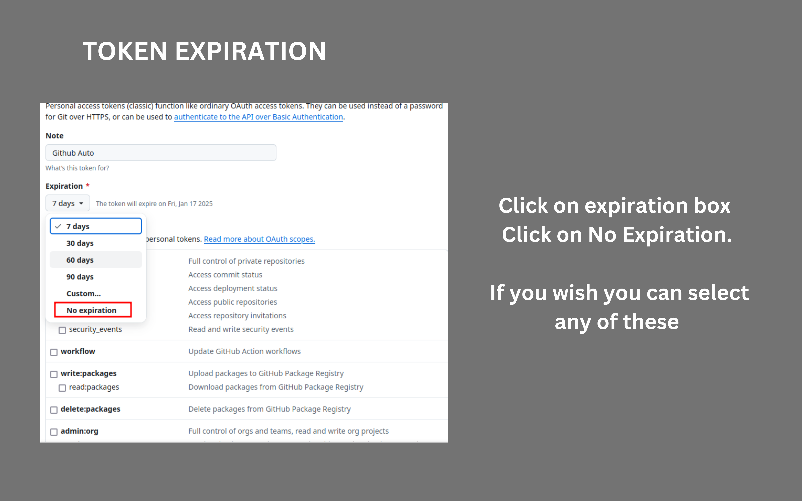

### Step 10: Select Scopes
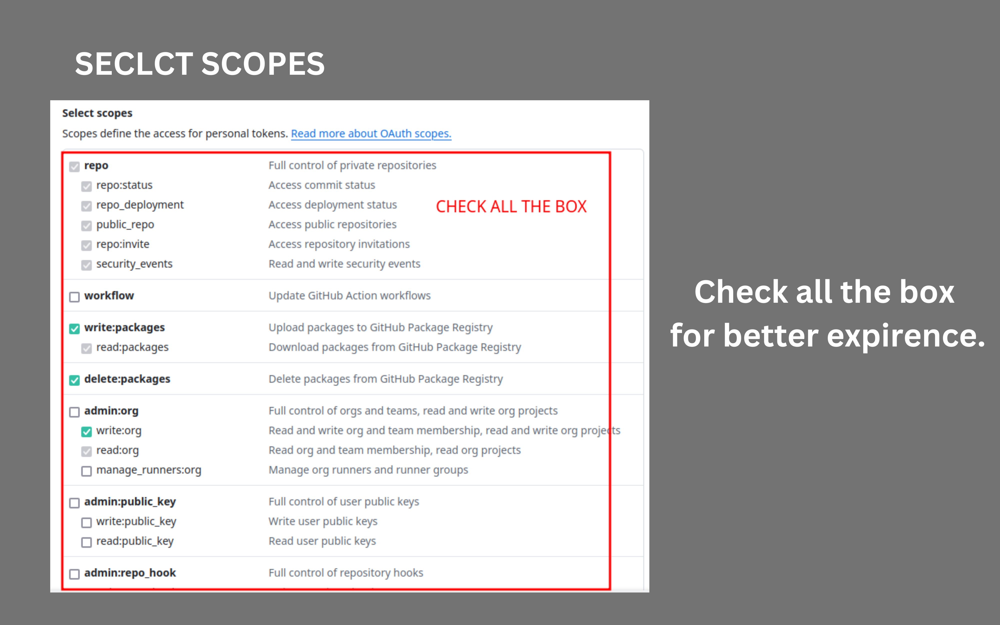

### Step 11: Generate Token
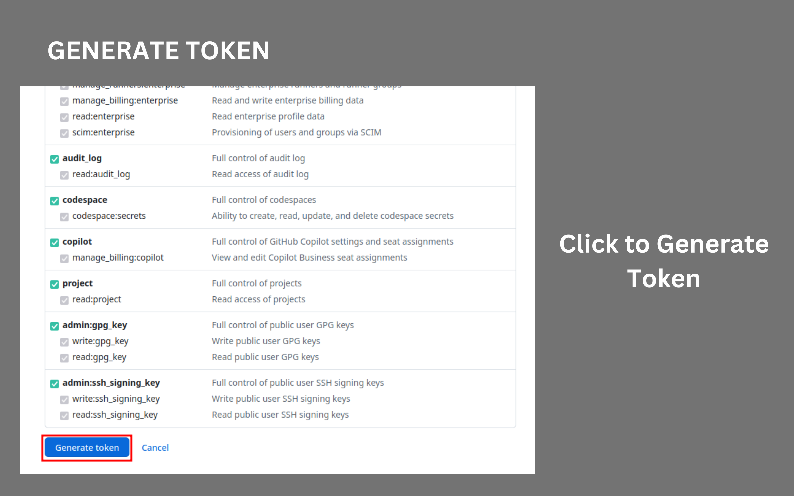

### Step 12: Congratulations
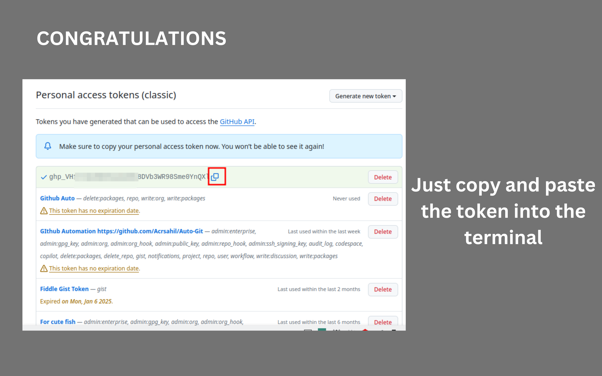    

### Step 13: Paste Token
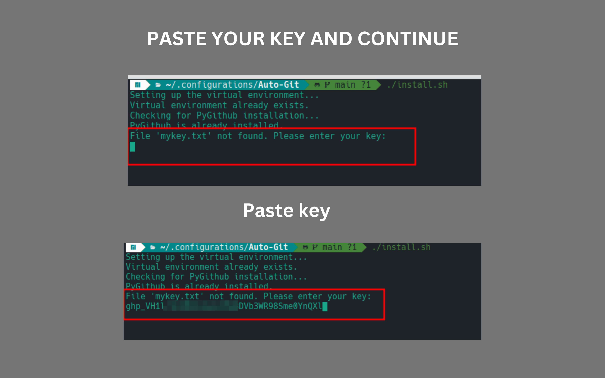 

### Step 14: Kick Out your issue!
 

## Examples

#### Create a Repository:📂

    gmkdir new-awesome-project

This will create a new repository named new-awesome-project.

#### Delete Repositories:🗑

    grmdir repo1 repo2

This will delete the repositories repo1 and repo2 from your GitHub account.

#### List Repositories:📜

    gls

This will list all the repositories in your GitHub account.

#### List Repositories Contents:📁

    gls repo1 repo2

This will list all the contents inside your repo1 and repo2.

## Requirements 📌

    Python 3.x
    GitHub Personal Access Token with appropriate permissions
    requests library (Install with pip install requests)

## Exit Status Codes 🚦

    0: Success ✅
    1: General error ❌
    2: Authentication failure 🔐
    3: Invalid repository name ⚠️

## Authors 👨‍💻👩‍💻

Sahil Das: Creator and Lead Developer 💻

## Bugs and Feedback 🐞

If you encounter any issues or have suggestions for improvements, please open an issue on the GitHub Repository. We'd love to hear from you! 😄

Happy automating! 🚀
